<p align="center">

  <br/>


</p>

[İkinci El Project](https://ciceksepeti-patika-graduation-project.vercel.app) It's full featured e-commerce app built as Patika & Çiçeksepeti React Bootcamp final project.

Live demo available here :
[Live Demo](https://ciceksepeti-patika-graduation-project.vercel.app)

## Content

- [About Project](#about-project)
- [Technologies Used](#technologies-used)
- [Installation](#installation)
- [Previews](#previews)
- [App Performance](#app-performance)

<br>
<br>

# About Project

- İkinci El Project is an E-Commerce app that allows users create, buy and sell products.

- If you already have an account you can sign-in. Else, you can register easily.
- You can offer products you want and product owner can accept or reject your offered price.
- The app developed for both web and mobile. All pages have responsive UI.

## Technologies Used

- ReactJS
- Redux
- Redux-Thunk
- SASS
- Axios
- Toastify
- uuid
- prop-types
- Vercel

## Installation

- First, clone the project:

```sh
git clone https://github.com/Ogzhnsfgl/ciceksepeti-patika-graduation-project.git
```

- Then, start the project on localhost:

```bash
# install dependencies with npm
npm install
# or install dependencies with yarn
yarn

# serve at localhost:3000
npm start

```

<br>
<br>

## About Project

- İkinci El Project is an E-Commerce app that allows users create, buy and sell products.

- If you already have an account you can sign-in. Else, you can register easily.
- You can offer products you want and product owner can accept or reject your offered price.
- The app developed for both web and mobile. All pages have responsive UI.

<br>
<br>

# Previews

<center>

## Web - Login Page


## Web - Home Page

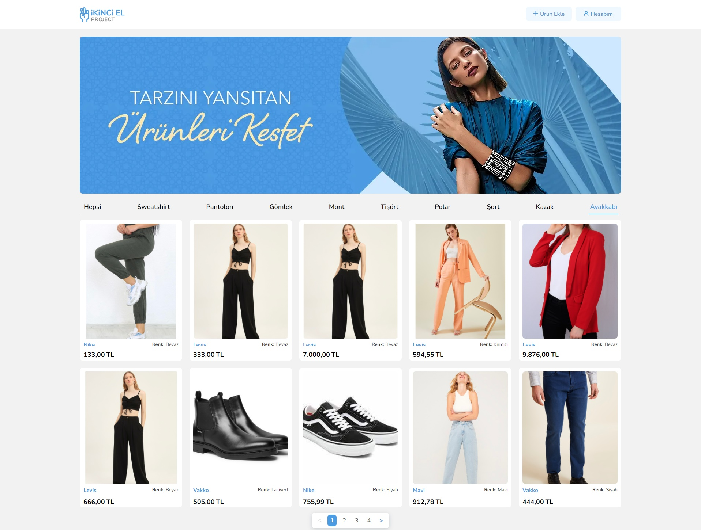

## Web - Product Detail Page

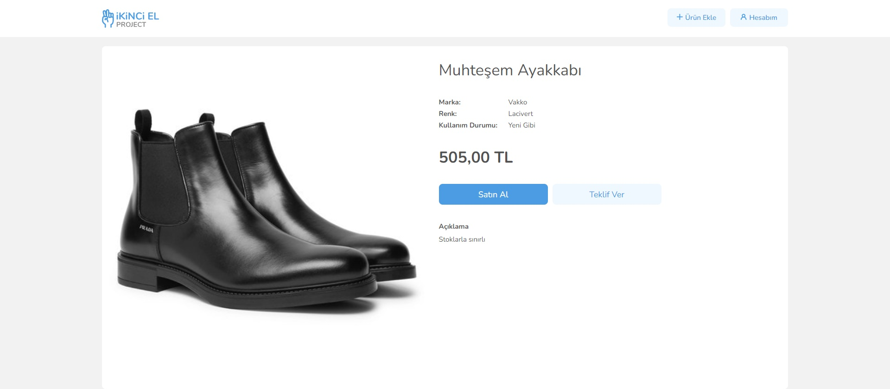
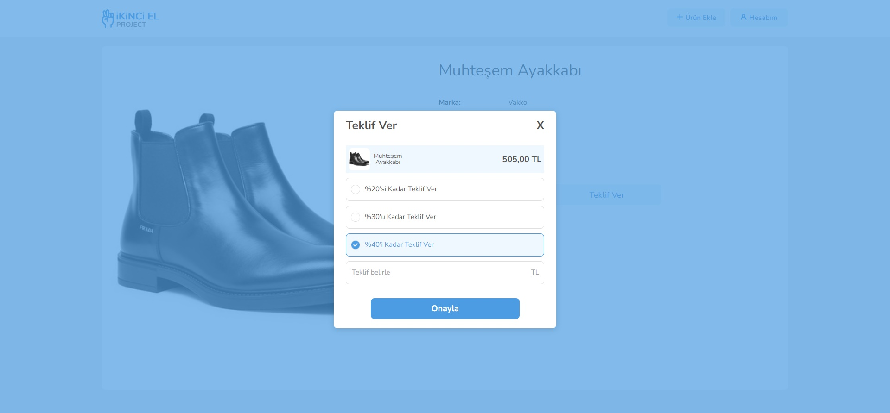

## Web - Account Page

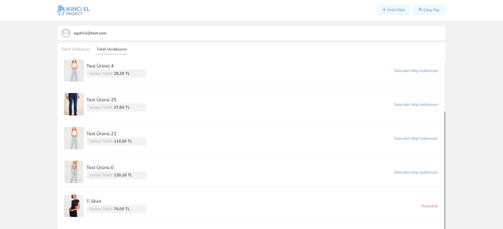
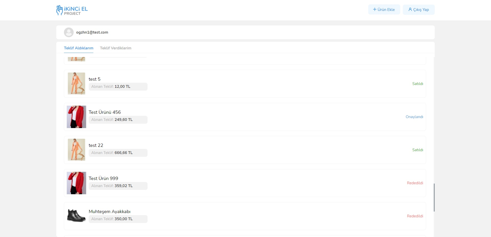

## Web - Add Product Page

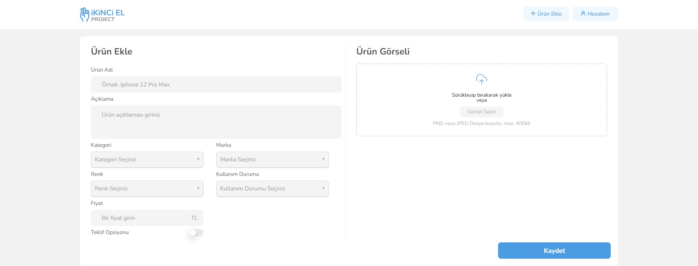


## Mobile

<p align="center">
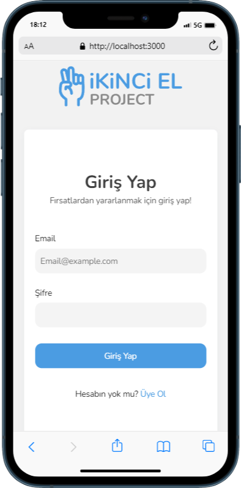
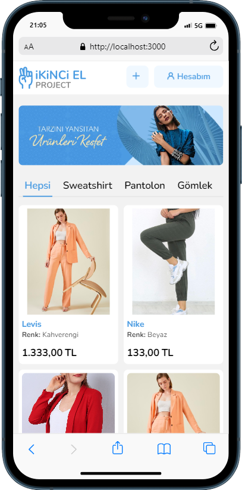
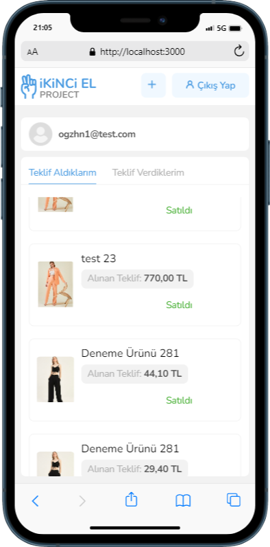
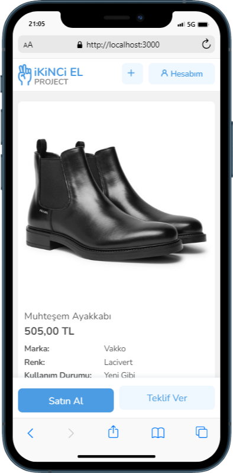
  
  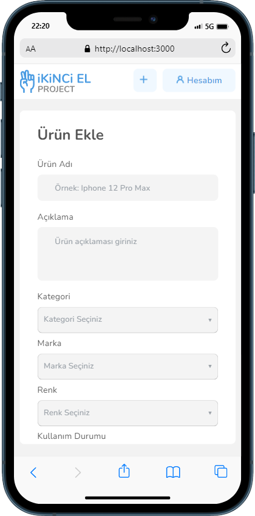
  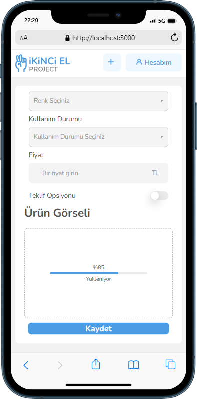
</p>
</center>

<br>
<br>

# App Performance

<center>

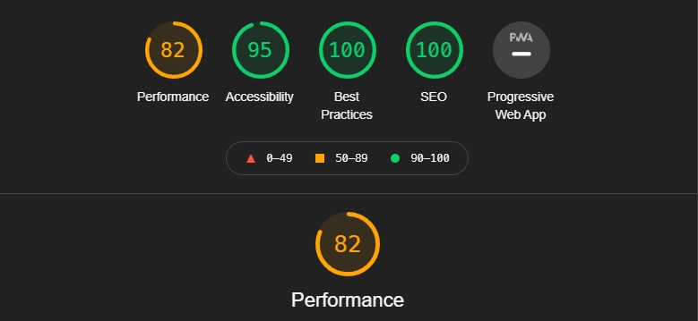

</center>
